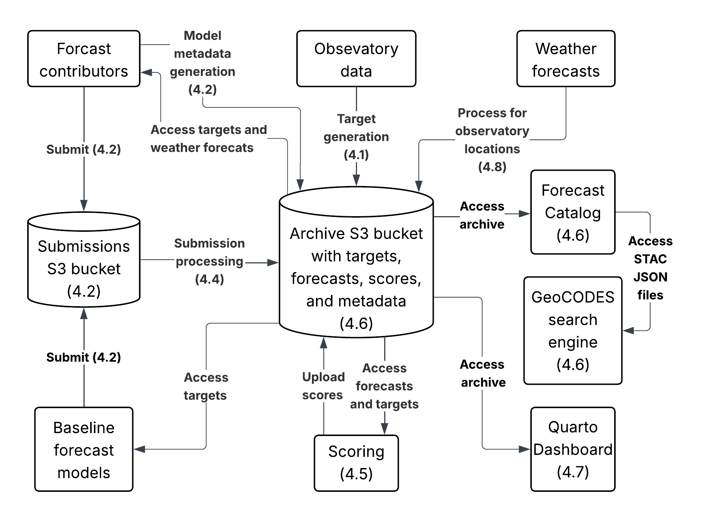

National Ecological Observatory Network (NEON) Ecological Forecasting Challenge

Authors: R. Q. Thomas and C. Boettiger

# 

The following elements of a forecasting challenge workflow are included in this repo. The GitHub Actions are the tool for automating the tasks.

1)  Generation of targets
2)  Processing of submissions
3)  Generation of baseline forecasts
4)  Evaluation (scoring) of submitted forecasts
5)  Generation of Quarto dashboard
6)  Generation of STAC catalog
7)  Creation of Docker containers with supporting software
8)  Download of weather drivers for forecasts

See <https://doi.org/10.1002/fee.2616> for more information on the structure of a forecasting challenge.

Supported by the U.S. National Science Foundation grants (DEB-1926388 and OAC-2209866)
